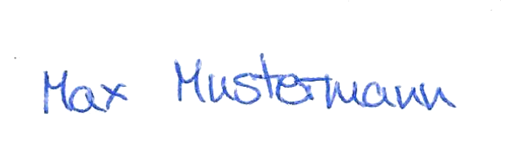

FALSISIGN
=========

Für unsere Auftragsarbeiten müssen wir sehr häufig unsere
Arbeitszeitberichte ausdrucken, unterschreiben, einscannen
und als PDF versenden. Dies ist insbesondere dann sehr
lästig, wenn kein Drucker oder Scanner greifbar ist.

[FALSISIGN](https://gitlab.com/edouardklein/falsisign.git)
scheint eine Lösung zu bieten: Man bereitet eine Reihe von
Unterschriften vor und fügt diese dann bei Bedarf in die
PDF-Dateien ein. So ähnlich wie dies:



Anwendung von diesem Repo
-------------------------

- Repo "clonen" (empfohlen) oder ZIP herunterladen und entpacken
- Formular ausdrucken - [signatures-empty.pdf](signatures-empty.pdf)
- Unterschriften eintragen (4x16 = 64 Unterschriften)
- Formular einscannen
    * Möglichst kein Rand!
    * Möglichst keine Verzerrung!
    * Scan-Qualität: Ausprobieren - Foto?
    * Beispiel-Ergebnis: [signatures-max.pdf](signatures-max.pdf)
- Unterschriften splitten: `./signdiv.sh signatures-max.pdf` (ersetze "signatures-max.pdf" durch den Dateinamen Deines Scans!)
- Beispiel von gesplitteten Unterschriften: [signatures-max](signatures-max)
- Dokument signieren
    * [uli.pdf](uli.pdf) per Skript: `./falsisign.sh uli.pdf 200x100+550+670 uli-signed.pdf` - [uli-signed.pdf](uli-signed.pdf)
    * [uli.xlsx](uli.xlsx) manuell: Dokument öffnen und eine der Unterschriften aus dem Verzeichnis "signatures" einfügen - [uli-signed.xlsx](uli-signed.xlsx)

Vorgehen beim Erstellen dieses Repos
------------------------------------

Nachfolgend eine kurze Beschreibung der Grundidee
dieses Projektes. Teile davon müssen nur einmalig
erledigt werden, Du mußt das nicht mehr machen!

1. Formular erstellen für die Unterschriften - [signatures-empty.odg (für LibreOffice)](signatures-empty.odg)
    * DIN A4
    * möglichst randlos
    * hochkant
    * 4 Spalten
    * 16 Zeilen
2. Github-Projekt mit "Clone or download" herunterladen und das ZIP entpacken
3. Formular ausdrucken - [signatures-empty.pdf](signatures-empty.pdf)
4. Unterschriften eintragen (4x16 = 64 Unterschriften)
5. Formular einscannen - [signatures-max.pdf](signatures-max.pdf)
6. Unterschriften splitten: `./signdiv.sh signatures-max.pdf`

   Erzeugt Unterschriftendateien im Unterverzeichnis "signatures" (Beispielunterschriften sind [hier](signatures-max))

7. PDF-Dokument signieren
    * Mittels Kommandozeilen-Skript: `./falsisign.sh uli.pdf 200x100+550+670 uli-signed.pdf` 

      Es wird zufällig eine der vorhandenen Unterschriften im Unterverzeichnis "signatures" ausgewählt.
      Momentan funktioniert das nur bei einseitigen PDF-Dokumenten.
      Breite, Höhe, X-Position und Y-Position in "200x100+550+670" müssen angepasst werden an
      das PDF-Dokument.

      [uli.pdf](uli.pdf), mit Unterschrift: [uli-signed.pdf](uli-signed.pdf)

    * Manuell: Unterschrift "zufällig" auswählen aus dem Unterordner "signatures" und als Bild einfügen
      in das Quelldokument

      Das manuelle Unterschreiben klappt für mich mit PDF/LibreOffice nicht sonderlich gut,
      es gibt Probleme bei der Größenanpassung der Unterschrift und beim Verschieben an die
      richtige Position

      Besser geht's mit Tabellen:
        * XLS: [timesheet.xls](timesheet.xls), mit Unterschrift: [timesheet-signed.xls](timesheet-signed.xls)
        * XLSX: [uli.xlsx](uli.xlsx), mit Unterschrift: [uli-signed.xlsx](uli-signed.xlsx)
        * ODS: [time](timesheet.ods), mit Unterschrift: [timesheet-signed.ods](timesheet-signed.ods)

Quelle und Änderungen
------

Dies ist ein Fork von [https://gitlab.com/edouardklein/falsisign.git](https://gitlab.com/edouardklein/falsisign.git).

Änderungen:

* Deutsche Anleitung (diese Datei)
* Formular in A4
* PDF-Wandlungen für ImageMagick freischalten für Ubuntu-18.04 und neuer

Probleme
--------

### PDF-Wandlung klappt nicht - convert: not authorized

Bei der Ausführung von `./signdiv.sh formular.pdf` erscheint eine Fehlermeldung dieser Art:

```
...
+ convert -density 576 -resize 3560x4752 -transparent white formular.pdf /tmp/falsisign-28220/signatures.png
convert: not authorized `formular.pdf' @ error/constitute.c/ReadImage/412.
convert: no images defined `/tmp/falsisign-28220/signatures.png' @ error/convert.c/ConvertImageCommand/3210.
...
```

Ursache: Aus Sicherheitsgründen ist ImageMagick auf vielen Systemen so konfiguriert, dass keine PDF-Dateien bearbeitet
werden können.

Abhilfe:
* Generelle Lösung:
    1. Wandlung nach PNG mittels `gs`
    2. Weiterverarbeitung mittels `convert` (=Teil von ImageMagick)
* Obsolet - Ubuntu-18.04 oder neuer: Problem sollte nicht mehr auftreten
* Obsolet - Ubuntu-16.04 oder älter: "policy.xml" entfernen - `sudo mv /etc/ImageMagick*/policy.xml /etc/ImageMagick*/policy.xml.deactivated`

### Eingescanntes Dokument: Oben und links fehlt ein Stück

- Bei "signatures-max.pdf" passt die Aufteilung nicht richtig - nach der Splittung mit "signdiv.sh" sind Linien auf den Splittern sichtbar!
- Speichern als PNG - 2480x3504 - /tmp/u.png
- Ermittlung: Wieviele Pixel fehlen? Oben: 20, links: 20
    * display /tmp/u.png
    * Menü öffnen
    * Image Edit - Region of Interest...
    * Feld in der Mitte auswählen
    * Mit Feld oben vergleichen - 20 Punkte höher
    * Mit Feld links vergleichen - 20 Punkte breiter
- Leeres PNG erzeugen: `convert -size 2500x3524 xc:white x.png`
- Zusammenfügen: `convert x.png /tmp/u.png -geometry +20+20 +profile '*' -composite y.png`
- PDF: `convert y.png y.pdf; gs -sDEVICE=pdfwrite -dCompatibilityLevel=1.4 -dPDFSETTINGS=/screen -dNOPAUSE -dQUIET -dBATCH -sOutputFile=y2.pdf y.pdf`
- Nachkontrolle: Dimensionen stimmen nun!
- Umbenennen: `mv y2.pdf signatures-max.pdf`

Änderungen
----------

* 2020-04-19: Anwendung dieses Repos, signatures-max.pdf korrigiert
* 2020-04-16: Wandlung mit `gs`, Formular signatures-empty.pdf und Muster-Scan signatures-max.pdf
